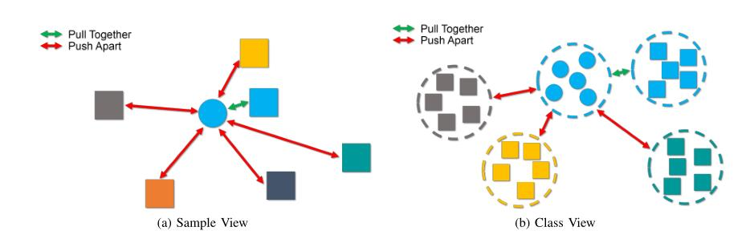
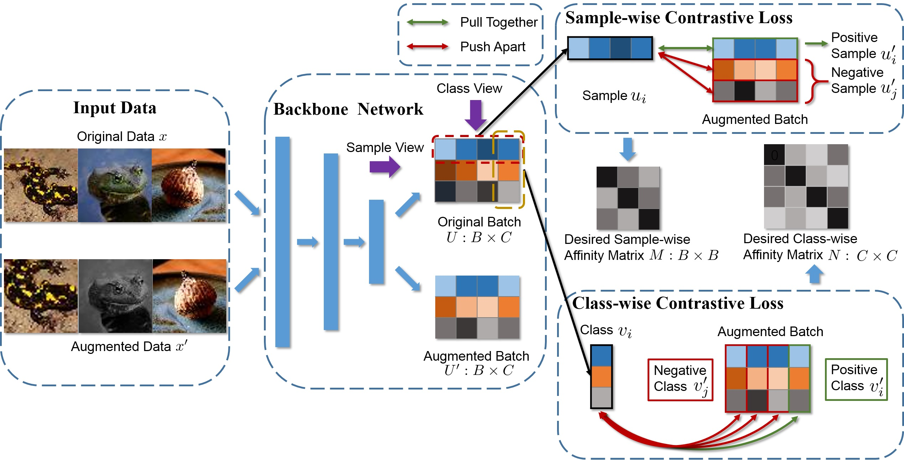

# DCDC: Doubly Contrastive Deep Clustering

Forked from PICA (https://github.com/Raymond-sci/PICA).

## Introduction

 Illustration of our idea. Do contrastive learning from two views: sample and class view. The goal of sample view is to pull positive sample pair together and push negative sample pairs apart. Class view intends to pull positive class pair together and push negative class pairs apart. 

## Framework

The framework of the proposed network: Doubly Contrastive Deep Clustering (DCDC). We have <b>Sample-wise Constrative Loss</b> and <b>Class-wise Constrastive Loss</b> in our DCDC method.

## Main Results

## Run
### Requirements
Python 2.7 and Pytorch 1.4.0 are required. Please refer to [environment.yml](./environment.yml) for more details.
### Usages
1. Clone this repo: `git clone https://github.com/ZhiyuanDang/DCDC.git`.
2. Download datasets: [CIFAR-10/100](https://www.cs.toronto.edu/~kriz/cifar.html), [STL-10](http://ai.stanford.edu/~acoates/stl10/) and [Tiny-ImageNet](http://cs231n.stanford.edu/tiny-imagenet-200.zip).
3. Examples of training DCDC on different datasets are provided in `/config`. Use the command `python main.py --cfgs configs/base.yaml configs/cifar100.yaml` to run the experiments on CIFAR100. Most of the dataset-irrelevant arguments, *e.g.* optimiser and backbone, are specified in `configs/base.yaml`. Hence, replace `configs/cifar100.yaml` by `configs/stl10.yaml` to run on STL-10. 
4. Use the flag `--data-root` in command line or modify the config files to set the data path.
5. The program is run on CPU by default, use the flag `--gpus GPU` to specify the gpu device you would like to use.

Every time the `main.py` is run, a new session will be started with the name of current timestamp and all the generated files will be stored in folder `sessions/timestamp/` including checkpoints, logs, etc. Use the flag `--session` to specify a session name and `--debug` to produce no file.

## Citation

