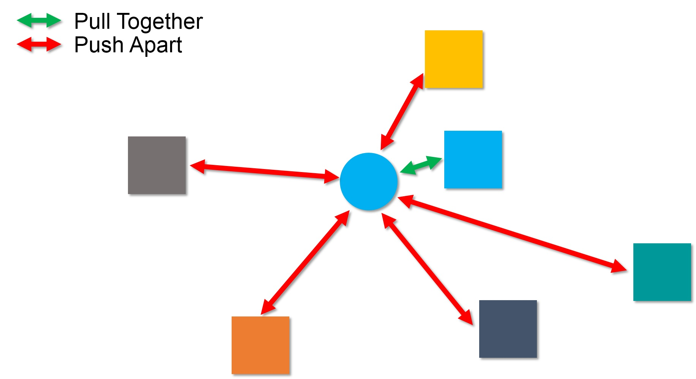
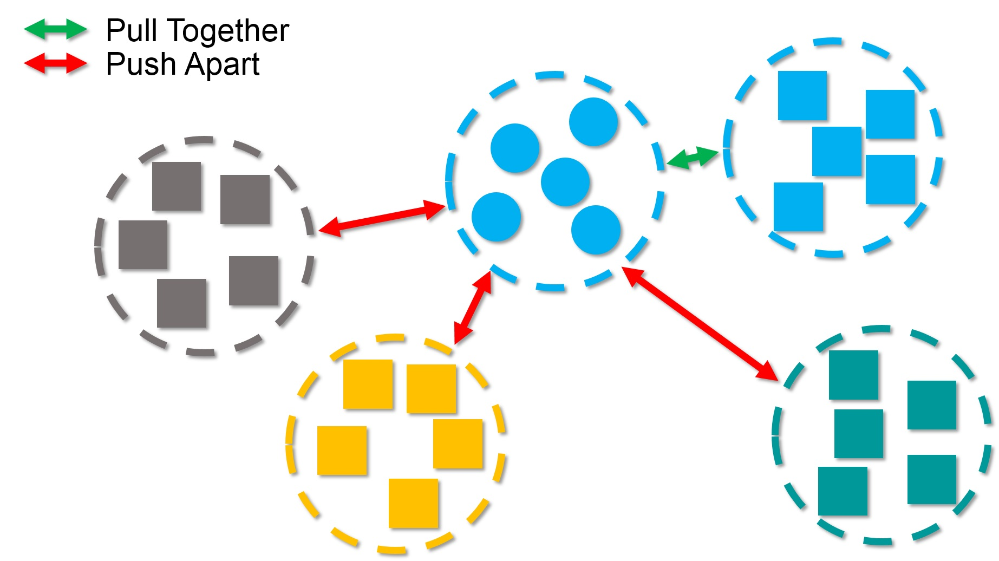

# DCDC: Doubly Contrastive Deep Clustering

Fork from PICA (https://github.com/Raymond-sci/PICA).

# Introduction

 Illustration of our idea. Do contrastive learning from two views: sample and class view. The goal of sample view is to pull positive sample pair together and push negative sample pairs apart. Class view intends to pull positive class pair together and push negative class pairs apart. 

